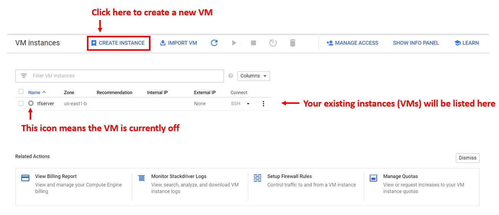
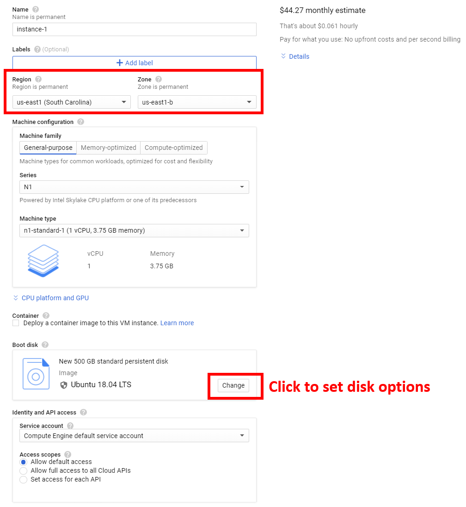
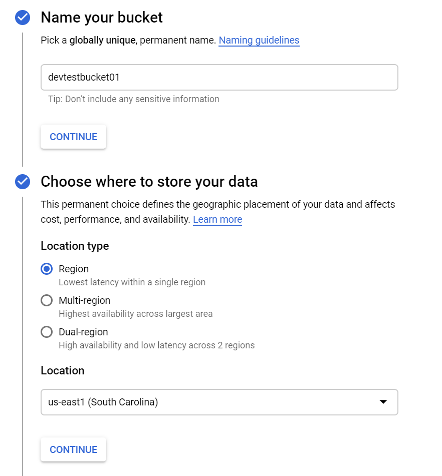

# Cloud servers
These are a collection of scripts and instructions to leverage cloud computing platforms for NGS analysis (like RNA-seq)

## Table of contents

+ [Cloud platforms](https://github.com/developerpiru/BEAVR#cloud-platforms)

  + [Google Cloud Platform (GCP)](https://github.com/developerpiru/BEAVR#google-cloud-platform)
  + [Amazon Web Services (AWS)](https://github.com/developerpiru/BEAVR#amazon-web-services)
  + [Microsoft Azure](https://github.com/developerpiru/BEAVR#microsoft-azure)
+ [Getting started with GCP](https://github.com/developerpiru/BEAVR#getting-started-with-gcp)

## Cloud platforms

### Google Cloud Platform (GCP)

### Amazon Web Services (AWS)

### Microsoft Azure

## Getting started with GCP

### Creating a new compute instance

1. From the [GCP Dashboard](https://console.cloud.google.com/home/dashboard), click on the menu button (1), then hover over **Computer Engine** to display the pop-up menu (2), then click on **VM instances** (3)
  
  
2. This is where all of your existing VMs will be listed. To create a new VM, click **Create Instance** at the top.
  

3. The page will ask you to specify details for your new VM instance.
  
  
  You need to specify these details:
  + Instance name
  + Region and zone: Select **us-east1** for Region because it is closest to you and the cheapest cost.
  + Machine configuration: select a prebuilt configuration or customize your own CPU and memory allotment. 
  + Click the **Change** button under **Boot disk** to specify the hard drive and OS configuration

    + Select Ubuntu for the **Operating system**
    + Select Ubuntu 18.04 LTS for **Version**
    + Set the size for 500 GB
    
  + Under **Identity and API access**, select **Allow full access to all Cloud APIs**
  + Under **Firewall**, select **Allow HTTP traffic** and **Allow HTTPS traffic**
  + Click the **Create** button at the button when you are done.

4. This will return you to the **VM instances** page where you will see your newly created instance. The green icon indicates the VM is currently running.


5. To connect to the VM, click on the **SSH** button (after ensuring it is on). You can use the menu button to Start, Stop, Reset, or Delete a VM.

### Creating a storage bucket

Think of a storage bucket as a cloud storage drive where you can save your files. You can use it as a shared folder to transfer files to and from your local computer to a VM. 

1. From the [GCP Dashboard](https://console.cloud.google.com/home/dashboard), click on the menu button, then click on **Storage**. 

2. This will open the storage browser and list any buckets you have (similar to the VM Instances page. Click **Create Bucket** at the top.

3. This will open a new page where you must enter details for your new bucket.

  + You must specify a globally unique name (meaning the name must not be taken by anyone else)
  + For **Location type**, select Region
  + For **Location**, select the **same region as the VM instances you have created!**
  + Leave all other settings as defaults and click **Create** at the bottom.

4. Your newly created bucket will be listed. Click on its name to view its contents (which will be empty right now).

5. You can upload files by using the buttons provided or by dragging files into the browser from your computer.

### How to setup a newly created VM

#### Setting up GCSFuse
A newly created VM only has a basic install of Ubuntu and you must now install any software you need. 

The first step is to install [gcsfuse](https://github.com/GoogleCloudPlatform/gcsfuse) on your new VM. Gcsfuse allows you to connect your VM to a storage bucket you own. This will "mount" your storage bucket as a virtual drive in your VM so you can transfer files to and from it. 

Copy and paste these commands to setup gcsfuse:
  ```
  export GCSFUSE_REPO=gcsfuse-`lsb_release -c -s`
  echo "deb http://packages.cloud.google.com/apt $GCSFUSE_REPO main" | sudo tee /etc/apt/sources.list.d/gcsfuse.list
  curl https://packages.cloud.google.com/apt/doc/apt-key.gpg | sudo apt-key add -
  sudo apt-get update
  sudo apt-get install gcsfuse
  mkdir mountfolder
  ```

You now have gcsfuse installed and have created a folder called "mountfolder". This is where you will mount your storage bucket.

Enter this command to mount your storage bucket:
  ```
  gcsfuse myBucketName mountfolder
  ```
  Where ```myBucketName``` is the name of the storage bucket you created.
 
